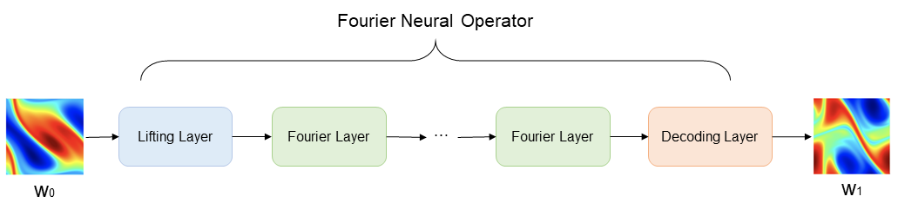
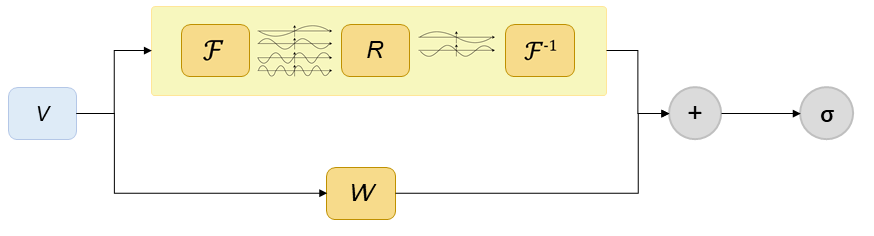
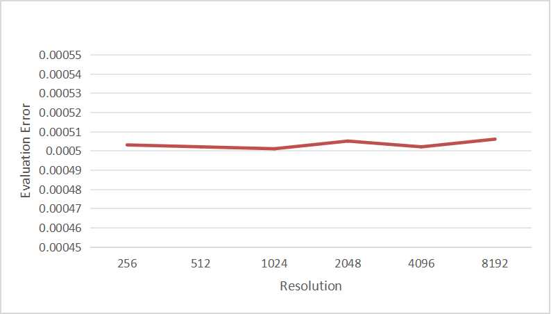

# FNO 算子求解 Burgers 方程

## 概述

### 背景

计算流体力学是 21 世纪流体力学领域的重要技术之一，其通过使用数值方法在计算机中对流体力学的控制方程进行求解，从而实现流动的分析、预测和控制。传统的有限元法（finite element method，FEM）和有限差分法（finite difference method，FDM）常用于复杂的仿真流程（物理建模、网格划分、数值离散、迭代求解等）和较高的计算成本，往往效率低下。因此，借助AI提升流体仿真效率是十分必要的。

近年来，随着神经网络的迅猛发展，为科学计算提供了新的范式。经典的神经网络是在有限维度的空间进行映射，只能学习与特定离散化相关的解。与经典神经网络不同，傅里叶神经算子（Fourier Neural Operator，FNO）是一种能够学习无限维函数空间映射的新型深度学习架构。该架构可直接学习从任意函数参数到解的映射，用于解决一类偏微分方程的求解问题，具有更强的泛化能力。更多信息可参考[Fourier Neural Operator for Parametric Partial Differential Equations](https://arxiv.org/abs/2010.08895)。

这里参考论文和 [mindscience实现](https://gitee.com/mindspore/mindscience/tree/master/MindFlow/applications/data_driven/burgers/fno1d) 介绍利用傅里叶神经算子的 1-d Burgers 方程求解方法。

### 问题描述

一维伯格斯方程（1-d Burgers' equation）是一个非线性偏微分方程，具有广泛应用，包括一维粘性流体流动建模。它的形式如下：

$$
\partial_t u(x, t)+\partial_x (u^2(x, t)/2)=\nu \partial_{xx} u(x, t), \quad x \in(0,1), t \in(0, 1]
$$

$$
u(x, 0)=u_0(x), \quad x \in(0,1)
$$

其中 $u$ 表示速度场, $u_0$ 表示初始条件, $\nu$ 表示粘度系数。

利用 Fourier Neural Operator 学习初始状态到下一时刻状态的映射，实现一维 Burgers'方程的求解：

$$
u_0 \mapsto u(\cdot, 1)
$$

### 技术路径

Fourier Neural Operator 模型构架如下图所示。图中 $w_0(x)$ 表示初始涡度，通过 Lifting Layer 实现输入向量的高维映射，然后将映射结果作为 Fourier Layer 的输入，进行频域信息的非线性变换，最后由 Decoding Layer 将变换结果映射至最终的预测结果 $w_1(x)$。

Lifting Layer、Fourier Layer 以及 Decoding Layer 共同组成了 Fourier Neural Operator。



Fourier Layer 网络结构如下图所示。图中 V 表示输入向量，上框表示向量经过傅里叶变换后，经过线性变换 R，过滤高频信息，然后进行傅里叶逆变换；另一分支经过线性变换 W，最后通过激活函数，得到 Fourier Layer 输出向量。



## Quick Start

1. 使用华为云的 [ModerArts](https://console.huaweicloud.com/modelarts/) 平台中的 notebook 开发环境，选择公共镜像中的 `mindquantum0.9.0-mindspore2.0.0-cuda11.6-ubuntu20.04` 创建 notebook（需要使用 2.0.0 以上版本的 mindspore）。GPU 使用 1*Tnt004 (16GB)，ICPU 为 8 核 32GB。

2. clone 本仓库到 notebook 中，打开终端，使用如下命令更新 mindspore 版本和配置 mindflow 环境。
    
    ```shell
    # 更新 mindspore 版本，我们使用 2.2.14 版本
    pip install --upgrade mindspore

    export DEVICE_NAME=gpu
    pip install mindflow_${DEVICE_NAME}
    ```

3. 数据集下载地址：[data_driven/burgers/fno1d/dataset](https://download.mindspore.cn/mindscience/mindflow/dataset/applications/data_driven/burgers/dataset/). 数据集已保存在仓库的 `dataset` 路径下。参考后文两种训练方式运行。

### 训练方式一：在命令行中调用 `train.py` 脚本

```shell
python train.py --config_file_path ./configs/fno1d.yaml --device_target GPU --device_id 0 --mode GRAPH
```

其中，

`--config_file_path` 表示配置文件的路径，默认值 './configs/fno1d.yaml'；

`--device_target` 表示使用的计算平台类型，可以选择 'Ascend'或'GPU'，默认值 'GPU'；

`--device_id` 表示使用的计算卡编号，可按照实际情况填写，默认值 0；

`--mode` 表示运行的模式，'GRAPH' 表示静态图模式, 'PYNATIVE' 表示动态图模式。

### 训练方式二：运行 Jupyter Notebook（推荐）

可以使用[中文版](./FNO1D_CN.ipynb)Jupyter Notebook 逐行运行训练和验证代码。

## 结果展示


## 性能

| 参数               | Ascend               | GPU                |
|:----------------------:|:--------------------------:|:---------------:|
| 硬件资源                | Ascend Snt9IARM:24核，显存 96GB           | NVIDIA 004, 显存16G    |
| MindSpore版本           | >=2.1.0                 | 2.2.14                  |
| 数据集                  | [一维 Burgers 方程分辨率数据集](https://download-mindspore.osinfra.cn/mindscience/mindflow/dataset/applications/data_driven/burgers/)      | [一维 Burgers 方程分辨率数据集](https://download-mindspore.osinfra.cn/mindscience/mindflow/dataset/applications/data_driven/burgers/)                   |
| 参数量                  | 5.5e5                   | 5.5e5                   |
| 训练参数                | resolution=1024, modes=16, hidden_channels=64, depth=4, batch_size=8, epoch=100 | resolution=256, modes=16, hidden_channels=64, depth=10, batch_size=64, epoch=1000 |
| 测试参数                | batch_size=64          | batch_size=64               |
| 优化器                  | Adam                 | Adam                   |
| 训练损失(MSE)           | 0.018363               |  0.01368600            |
| 验证损失(RMSE)          | 0.000503                | 0.0037078187             |
| 速度(ms/step)           | 33                   | 9                |

取不同分辨率下的数据集进行测试，根据以下结果可得出数据集分辨率对训练结果没有影响。



## 资料来源

- [Fourier Neural Operator for Parametric Partial Differential Equations](https://arxiv.org/abs/2010.08895)
- [MindSpore 官网](https://www.mindspore.cn/)
- [MindFlow 官网](https://www.mindspore.cn/mindflow/docs/zh-CN/master/index.html)
- [全连接网络求解 Burgers 方程](https://gitee.com/mindspore/mindscience/tree/master/MindFlow/applications/physics_driven/burgers)
- [FNO1D 实现](https://gitee.com/mindspore/mindscience/tree/master/MindFlow/applications/data_driven/burgers/fno1d)